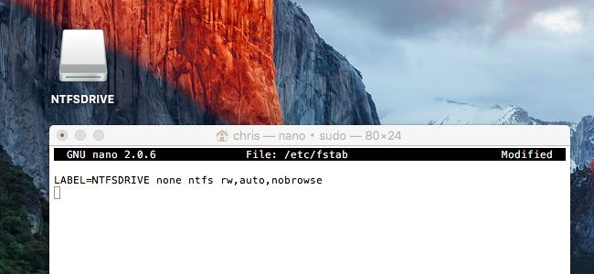
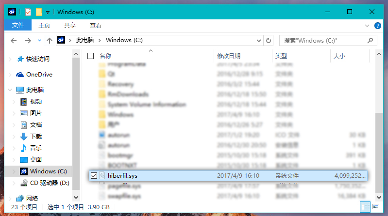

# 开启 Mac OS 原生「写」NTFS功能

> 在国内的环境下，如果你能忍住只用Mac OS，那你真的是很棒棒（爱学习）了，但是双（N）系统又带来一个问题，如何处理Win与Mac各自的文件？
> 
> Win下可以直接通过安装「HFS+for windows」访问HFS+分区,而Mac对NTFS分区跟5.0之后的安卓一样，只能读，不可写（此中关系不详），很多人选择使用插件，然而  
> 
> *   一来，插件贵
> * 二来，对极端分子来说，**原生**就是信仰,原生能解决的，绝不用插件

* * *

> 其实之前自己折腾这个的时候是截了很多图的……
> 
> 但是主力机上个月底送到售后去了，因为是之前的之前摔坏了外壳，这次顺带把主板也换一下。估计得到月底才能回来，所以现在用的 z8300 的破板板，不到低压i5 1/5 的性能，再者 Cherry Trail 驱动一直堪忧，搞linux都凑不全，自然是没有搞黑苹果的意义了。
> 
> 好吧，我只是想说…………OS X 这次没有图，没有图，图~~(有也不是我的，哈哈)

Mac对NTFS「写」的支持的支持早已有之，所以网上教程也不少了，但是99%都是针对Win7的，以及之后互相「转载」的，坑爹之处，下文分解。

*   按住command+空格，弹出Spotlight，输入`term`，便会自动定位到终端(Terminal)

在终端内输入：`diskutil list`

> 列出当前电脑的所有分卷信息

应该是这个样子的  

	/dev/disk0 (internal, physical):
    #:                       TYPE           NAME                    SIZE       IDENTIFIER
    0:      GUID_partition_scheme    			           *121.3 GB   disk0
    1:                        EFI           EFI                    209.7 MB    disk0s1
    2:                  Apple_HFS         Macintosh HD             88.0 GB     disk0s2
    3:                 Apple_Boot         Recovery HD              650.0 MB    disk0s3
    4:       Microsoft Basic Data         BOOTCAMP                 32.5 GB     disk0s4

其中 TYPE 为 Microsoft Basic Data 的便是NTFS分区，  

这里吐槽下Win下的DiskPart工具
`disk0s1`真的比`Sel disk x`再`Sel Part x`方便不少

修改fstab文件，来挂载NTFS分区的写功能
/etc目录需要root权限，所以这一步需要获取权限

*   `sudo vim/etc/fstab`

    当然，要是不喜欢vim，nano也是没问题的

*   在文件内添加

`LABEL=PartName ntfs rw,auto,nobrowse`  
 或  
`UUID=UUIDcode ntfs rw,auto,nobrowse`  

> PartName就是上面NTFS分区的NAME，
> UUIDcode是分区的UUID号码，在「实用工具」的**系统信息**里面可以找到，直接CMD+C复制即可[因为有的硬盘是SATA有的是NVME的，所在位置会有所差异]

**个人更推荐UUID的方式，因为除非分区（重装系统），UUID是不会变的，而分区的Name说不定在Windows下随手F2一下就给重命名了，这时候Mac会是无法启动，需要修改回来的**

> *   如果有空格要用\040代替，
> 还有其他字符的，自己翻ASCII码表吧
> *   有多个分区的话直接复制，接到下一行，修改成对应的UUID

*   保存

然后进入「磁盘工具」，将NTFS分区卸载，再重新装载，理应就可以对NTFS分区进行写操作了

> **所有的教程都在这里戛然而止，但是单单这样其实是看不到什么改变的，打开Mac OS的「系统日志」，会发现有3行错误，大概是
> `挂载XXX分区失败`**  
> 
> **`Windows is hibernated……`
> （没有图，自行脑补吧~）**

原因是Win8之后，Windows引入了「快速启动」技术，即「混合启动」，
通过借助于「睡眠」实现快速开机，即便是HDD也可以进入10秒，
这样的问题在于上一次开机时的Windows数据会缓存到`hiberfil.sys`文件里，Mac以及一些其他UNIX系统会认为贸然开启写分区功能是危险的，所以刚刚会失败，解决方法很直接    

> 把`hiberfil.sys`文件搞掉就可以了

一开始我想直接在「电源选项」里关闭「睡眠」和「快速启动」就完事了，
但这仅仅是关闭了睡眠的入口，实际上并没没有干掉`hiberfil.sys`文件  

最后的解决办法是
进入Windows  

*   打开 CMD/PowerShell
*   输入`powercfg -h off`
*   回车，重启，完事
