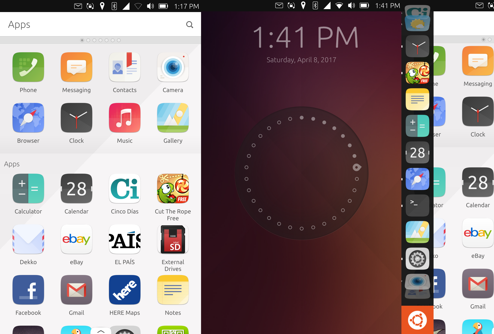
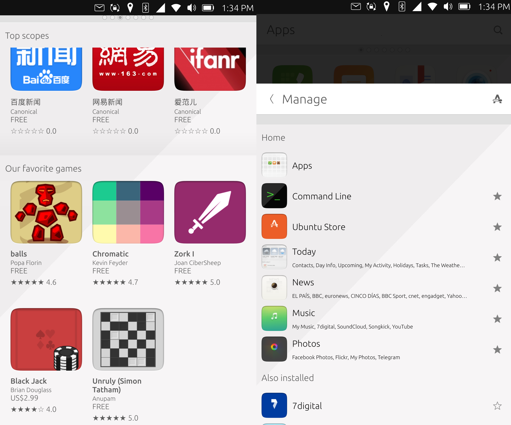

> ##最近几天Ubuntu家发生了两件大事  

* Ubuntu 将于LTS 18.04 版回归 GNOME 界面
* Ubuntu touch 即将寿终正寝（被放气啦）

#####像之前Firefox OS的命运一样，Ubuntu touch的冬天也还是来了
##今天就来谈一谈Ubuntu touch吧  

   
####半年前发布的OTA13，
  

####[基于LTS 15.04，
####彼时桌面版已经是LTS 16.04了]
***
> ###Ubuntu Touch从某种意义上让人想起了WindowsPhone，  
 ###都承载着巨人们“三屏一云”的雄伟蓝图
 ###交互、UI上都另辟蹊径
 ###如今却又都光景惨淡
 
####UI上，Ubuntu touch与桌面版风格一致，都是红、紫、橙的暖色调  
####加上标志性的侧边栏 

***

##类似于wp的磁帖，Ubuntu touch推出了Scope的概念，  
##让信息可以更直接高效地被获取

> 应用商店还是有中文的应用&Scope的…………

##交互上，Ubuntu touch引入了丰富的滑动操作（越来越觉得理念跟wp是一致的哇……）
##* 底部上拉，呼出scope设置
##* 左侧右滑，全局返回
##* 右侧左滑： 
###* 		短距离：切换最近使用的上一个程序 
###* 		长距离：打开多任务列表 
> 这招后来被加入了3D touch的iPhone学去了

##对通知栏的处理上，Ubuntu touch拉出通知栏之后按住并滑动，可以在各项设置之间切换

***
###打着Ubuntu的旗号，虽然是基于CM，
###但是Ubuntu touch依然有着手机端最好用的终端程序

#####作为对比，
#####已经安装了BusyBox的Android7.0是这个样子的，

####Ubuntu Terminal的强大不仅仅是因为支持的指令丰富，
####更是因为对触控操作的优化，已经远远超过了各种‘模拟器’之流

---
> ###单指点击对应 `Tab`  
> ###单指拖动滚动当前输入的代码  
> ###双指拖动滚动屏幕代码
> ###丰富的功能键&组合键支持

###出身高贵的Ubuntu touch最终沦落到今天这个样子，也自然是有原因的

##1.应用
* 应用资源匮乏  
 抛弃了JVM的Ubuntu touch一方面无法兼容安卓程序，  
 当然这其中有建立自己生态的长远考量，  
 但linux本来就鲜有面向普通消费者的应用开发，  
 使得系统生态的起步更为艰难  
 [连预装的 HERE 地图都已经不提供支持了]
##2.运行效率
* 由QT和HTML5搭建的自家应用运行效率亦不高，  
 **甚至于我会觉得本机上CM13的流畅度才应该是Ubuntu touch应有的表现**  
 **Ubuntu与如今安卓的体验倒挂了** 
##3. 缺乏高端旗舰  
 * Canonical自己联合BQ之流发布过几代Ubuntu手机，但配置都会连红米1代都        不如的超低端机
  而联合魅族发布的Ubuntu 版MX4、Pro5出货又极少  
  一如当年520发货量超过一半的Lumia,  
  仅仅有低端机，
  如何建立口碑？如何树立品牌？  
  如何能吸引开发者开发高质量的应用？

> ###手机端操作系统的马太效应愈发明显  
> ###安卓、iOS两大平台愈发趋同  
> ###全民刷机的时代早已过去  
> ###一方面是市场的成熟、饱和  
> ###一方面又是死寂与无聊